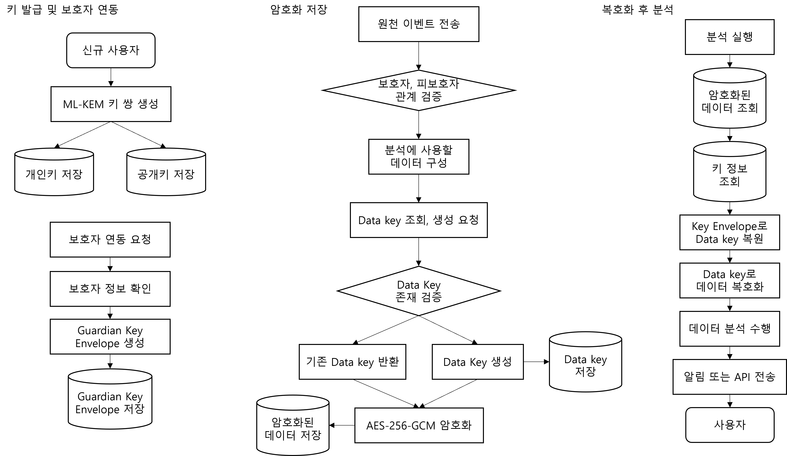

# Security Module

본 모듈은 OnCare24 프로젝트에서 로그 분석 결과를 암호화하고, Java/Python 환경에서 Rust 기반 암호화 기능을 FFI로 호출하기 위한 보안 모듈이다.

주요 목적은 다음과 같다.

- 로그 분석에 필요한 원천 데이터를 AES-256-GCM으로 암호화
- Data Key를 ML-KEM 기반 Key Envelope로 보호
- 사용자와 보호자 각각이 동일한 암호화 데이터를 열람할 수 있도록 Envelope 생성
- Java JNA 및 Python ctypes를 통한 FFI 연동 지원
- 백엔드 서버에서 Rust FFI DLL을 호출하는 구조 제공

---

## 1. 라이선스

본 프로젝트는 다음 외부 암호화 라이브러리를 사용한다.

### oqs

- License: MIT OR Apache-2.0
- Repository: https://github.com/open-quantum-safe/liboqs-rust
- 설명: Rust에서 Open Quantum Safe의 양자내성암호 기능을 사용할 수 있도록 제공하는 라이브러리다.

### oqs-sys

- License: MIT OR Apache-2.0
- Repository: https://github.com/open-quantum-safe/liboqs-rust
- 설명: `liboqs` C 라이브러리에 대한 Rust FFI 바인딩을 제공한다.

### liboqs

- License: MIT
- Repository: https://github.com/Open-Quantum-Safe/liboqs
- 설명: Open Quantum Safe 프로젝트에서 제공하는 양자내성암호 C 라이브러리다.
- Note: `liboqs` 내부에는 일부 별도 라이선스를 가진 외부 구성요소가 포함될 수 있다.

본 프로젝트에서 배포하는 `crypto_ffi.dll`은 위 라이브러리들을 사용하여 빌드된다.

---

## 2. 백엔드 서버 DB 및 OpenBao 저장 항목

현재 백엔드는 복약 일정, 복약 기록, 위치 보고, 디바이스 상태 변화처럼 분석의 입력이 되는 원천 이벤트를 `encrypted_activity_log` 테이블에 암호화된 패키지 형태로 저장한다.

복약 일정과 복약 기록은 민감한 상세값을 암호화 로그로 옮기고, 원본 도메인 테이블에는 연결 정보와 상태 관리용 메타데이터를 주로 남기는 구조이다.

위치 보고와 디바이스 상태도 `encrypted_activity_log`에 암호화 이벤트로 저장된다. 다만 현재 백엔드의 일부 기능 흐름에서는 `location_reports`, `device_status` 같은 원본 테이블에 위치 좌표, 정확도, 기기 상태, 마지막 보고 시각 등의 평문 운영 데이터도 함께 저장·사용한다.

일반 DB에는 Data Key 원문과 ML-KEM 개인키를 저장하지 않는다. 복호화에 필요한 키 재료는 OpenBao/KMS에 분리하여 저장한다.

---

### 2-1. 암호화 로그 테이블

현재 백엔드에서 암호화된 원천 이벤트는 `encrypted_activity_log` 테이블에 저장된다.

| 컬럼명 | 저장 값 | 구분 | 비고 |
|---|---|---|---|
| `id` | 암호화 원천 이벤트 ID | 기본 항목 | DB 기본 식별자 |
| `ward_id` | 피보호자 ID | 조회 메타데이터 | 어떤 피보호자의 이벤트인지 식별 |
| `event_type` | 원천 이벤트 종류 | 조회 메타데이터 | 예: `MEDICATION_EVENT`, `LOCATION_EVENT`, `DEVICE_EVENT` |
| `source_table` | 원천 데이터가 발생한 테이블명 | 조회 메타데이터 | 예: `medication_schedule`, `medication_log` |
| `source_id` | 원천 데이터 ID | 조회 메타데이터 | 원본 도메인 데이터와 연결하기 위한 참조값 |
| `occurred_at` | 이벤트 발생 시각 | 조회 메타데이터 | 원천 이벤트가 실제 발생한 시각 |
| `encrypted_package` | 암호화된 원천 이벤트 패키지 | 암호화로 추가 | 이 컬럼에는 평문 원천 데이터가 아니라 암호화된 패키지를 저장 |
| `aad_json` | 검증용 메타데이터 JSON | 암호화로 추가 | 복호화 후 metadata와 비교하여 위변조 여부 확인 |
| `data_key_id` | 암호화에 사용한 Data Key 식별자 | 암호화로 추가 | Data Key 원문이 아니라 식별자만 저장 |
| `created_at` | 저장 시각 | 공통 항목 | 공통 시간 필드 |
| `updated_at` | 수정 시각 | 공통 항목 | 공통 시간 필드 |

`encrypted_package`에는 AES-256-GCM 암호화 결과와 복호화에 필요한 패키지 정보가 포함된다.

따라서 `ciphertext`, `iv`, `tag`를 각각 DB 컬럼으로 분리하지 않고, FFI가 생성한 암호화 패키지 전체를 하나의 컬럼에 저장한다.

---

### 2-2. Key Envelope 저장 위치

현재 백엔드는 Key Envelope를 일반 DB 테이블에 저장하지 않는다.  
Key Envelope는 OpenBao/KMS에 저장한다.

저장 경로 예시는 다음과 같다.

```text
cap2/key-envelopes/{key_id}/user-{userId}
cap2/key-envelopes/{key_id}/guardian-{guardianId}
```

---
### 2-3. 데이터 암호화 매핑

OnCare24 보안 모듈은 복약 일정, 복약 기록, 위치 보고, 기기 상태 데이터를 암호화된 패키지로 변환하고, 복호화에 필요한 키 재료는 OpenBao에 분리하여 저장한다.

데이터별 암호화 전 입력값, 암호화 후 생성 데이터, DB 저장값, OpenBao 저장값 예시는 아래 문서에서 확인할 수 있다.

- [데이터 암호화 매핑](./docs/data-encryption-mapping.md)
---

## 3. 보안 구조도
흐름도 


---

## 3-1. 전체 흐름 요약

```text
1. 사용자 가입 시 ML-KEM 키 쌍 생성
2. 사용자 ML-KEM 공개키/개인키는 OpenBao/KMS에 저장
3. 보호자 연동 요청 시 보호자-피보호자 관계를 일반 DB에 PENDING으로 저장
4. 피보호자 수락 시 관계를 ACCEPTED로 변경
5. 보호자 공개키 기준으로 Guardian Key Envelope를 생성하고 OpenBao/KMS에 저장
6. 모바일 앱이 복약, 위치, 디바이스 상태 등 원천 이벤트 전송
7. 백엔드 서버가 사용자 인증 및 보호자-피보호자 관계 검증
8. 백엔드 서버가 분석에 사용할 원천 이벤트 payload 구성
9. 백엔드 서버가 OpenBao/KMS에서 Data Key 원문을 조회하거나 생성
10. 백엔드 서버가 Data Key로 원천 이벤트 payload를 AES-256-GCM 암호화
11. 암호화된 원천 이벤트는 encrypted_package 형태로 일반 DB에 저장
12. encrypted_activity_log에는 encrypted_package, data_key_id, aad_json, event_type, source_table, source_id, occurred_at 등 암호화 패키지와 조회/검증용 메타데이터를 저장
13. 분석 실행 시 백엔드 서버가 일반 DB에서 암호화된 원천 이벤트를 조회하고 OpenBao/KMS에서 필요한 키 정보를 조회
14. 백엔드 서버가 Rust FFI로 원천 이벤트를 복호화한 뒤 복약 분석 또는 비활동 분석 수행
15. 분석 결과를 알림 또는 API 응답으로 사용자/보호자에게 반환
```

이 구조의 핵심은 다음과 같다.

```text
백엔드 서버가 원천 이벤트 데이터를 AES-256-GCM 암호화 저장
분석 시점에 원천 이벤트를 복호화
복호화된 원천 이벤트로 분석 수행
분석 결과는 알림/API 응답으로 반환
```
---

## 3-2. 보안 구조도 설명

모바일 앱과 일반 DB에는 핵심 키 원문을 두지 않고, 백엔드에서 권한을 검증한 뒤 OpenBao/KMS와 연동하여 암호화·복호화·분석을 수행한다.

원천 이벤트는 `encrypted_activity_log`에 암호화된 패키지로 저장되며, 현재 백엔드 구현상 일부 도메인 테이블은 서비스 흐름을 위해 운영용 데이터를 함께 사용할 수 있다.

전체 신뢰 구역은 다음과 같이 구분한다.

- 모바일 앱: 비신뢰 구역
  - 복약 기록, 위치 정보, 디바이스 상태 전송
  - 사용자 ID, 역할, 보호자 관계 정보는 서버에서 재검증
  - Data Key, ML-KEM 개인키, 평문 민감 데이터 저장 불가
  - 암호화 키 관리 권한 없음

- 백엔드 서버: 부분 신뢰 구역
  - 사용자 인증 및 보호자-피보호자 관계 검증
  - 원천 이벤트 데이터 암호화 저장
  - 필요 시 암호화된 원천 이벤트 복호화 후 분석
  - Rust FFI를 통한 AES-256-GCM 암호화 및 ML-KEM Key Envelope 생성
  - 일반 DB에 Data Key 원문과 ML-KEM 개인키 저장 금지
  - 원천 이벤트는 `encrypted_activity_log`에 암호화된 패키지로 저장
  - 일부 도메인 테이블은 현재 서비스 흐름을 위해 운영용 데이터를 함께 사용할 수 있음

- OpenBao/KMS: 신뢰 구역
  - Data Key 원문 저장
  - ML-KEM 개인키 저장
  - 사용자/보호자용 Key Envelope 저장
  - 일반 DB와 분리된 키 관리
  - 백엔드 요청에 따라 필요한 키 정보 제공

---

## 4. FFI로 제공하는 기능

본 모듈은 `crates/crypto-ffi/include/crypto_ffi.h`의 C ABI를 Java JNA와 Python ctypes에서 호출한다.

| 함수명 | 기능 |
|---|---|
| `crypto_ffi_facade_new_default` | Rust `CoreFacade`를 감싼 FFI handle 생성 |
| `crypto_ffi_facade_free` | FFI handle 해제 |
| `crypto_ffi_byte_buffer_free` | Rust가 반환한 `FfiByteBuffer` 메모리 해제 |
| `crypto_ffi_generate_data_key` | 32바이트 Data Key 생성 |
| `crypto_ffi_generate_mlkem_keypair` | ML-KEM-1024 공개키/개인키 쌍을 생성하고 JSON 바이트로 반환 |
| `crypto_ffi_encrypt_package` | 평문, 사용자/보호자 공개키, Data Key로 암호화 패키지 JSON 생성 |
| `crypto_ffi_decrypt_package` | 암호화 패키지 JSON과 호출자 개인키로 평문 복호화 |
| `crypto_ffi_create_key_envelope` | 특정 소유자 공개키로 Data Key Envelope 생성 |
| `crypto_ffi_open_key_envelope` | Envelope와 소유자 개인키로 Data Key 복원 |
| `crypto_ffi_create_additional_recipient_envelope` | 기존 Envelope를 열 수 있는 소유자가 새 수신자 Envelope 생성 |
| `crypto_ffi_last_error_message_length` | 마지막 FFI 에러 메시지 길이 조회 |
| `crypto_ffi_last_error_message_copy` | 마지막 FFI 에러 메시지를 호출자 버퍼로 복사 |

현재 C ABI에는 ciphertext, iv, tag를 각각 받는 저수준 `encrypt`/`decrypt` 함수는 없다. 외부에서는 `encrypt_package`/`decrypt_package`가 주고받는 JSON 패키지를 사용한다.

---

## 5. FFI 입출력값 설명

공통 규칙은 다음과 같다.

- 모든 FFI 함수는 `FfiErrorCode`를 반환한다. 성공은 `FFI_ERROR_OK = 0`이다.
- 실패 시 마지막 에러 메시지는 `crypto_ffi_last_error_message_length`와 `crypto_ffi_last_error_message_copy`로 읽는다.
- Rust 내부 도메인 타입을 직접 외부로 넘기지 않고, C ABI용 구조체 또는 JSON 바이트 표현으로 변환한다.
- 입력 바이트는 `FfiBorrowedBytes { ptr, len }`로 전달한다. `ptr = NULL, len = 0`은 빈 바이트로 허용되지만, 필수 입력은 구현에서 빈 값 또는 null을 오류로 처리한다.
- 출력 바이트는 `FfiByteBuffer { ptr, len, capacity }`로 반환된다. 호출자는 복사 후 `crypto_ffi_byte_buffer_free`를 반드시 호출해야 한다.
- `FfiOwnerType`은 `USER = 1`, `GUARDIAN = 2`다.
- Python wrapper는 `bytes`, `str`, `int`, `FfiOwnerType`을 받아 내부에서 C 구조체로 변환한다.
- Java JNA wrapper는 `byte[]`, `String`, `long`, owner type 상수를 받아 내부에서 `Memory`, `Pointer`, JNA 구조체로 변환한다.

| 함수명 | 입력값 | 출력값 | 기능 |
|---|---|---|---|
| `crypto_ffi_facade_new_default` | `FfiFacadeHandle** out_handle` | handle pointer | Rust `CoreFacade`를 감싼 FFI handle 생성 |
| `crypto_ffi_facade_free` | `FfiFacadeHandle* handle` | 없음 | FFI handle 해제 |
| `crypto_ffi_byte_buffer_free` | `FfiByteBuffer buffer` | 없음 | Rust가 반환한 출력 버퍼 해제 |
| `crypto_ffi_generate_data_key` | handle, `key_id`, 생성/만료 Unix seconds | 32바이트 Data Key | AES-256-GCM용 Data Key 생성 |
| `crypto_ffi_generate_mlkem_keypair` | handle | ML-KEM keypair JSON bytes | ML-KEM-1024 공개키/개인키 쌍 생성 |
| `crypto_ffi_encrypt_package` | handle, `FfiEncryptPackageRequest*` | CryptoPackage JSON bytes | 평문 데이터를 암호화하고 사용자/보호자 Envelope를 포함한 패키지 생성 |
| `crypto_ffi_decrypt_package` | handle, `FfiDecryptPackageRequest*` | plaintext bytes | 암호화 패키지를 호출자 개인키로 복호화 |
| `crypto_ffi_create_key_envelope` | handle, `FfiCreateKeyEnvelopeRequest*` | KeyEnvelope JSON bytes | 특정 사용자/보호자가 Data Key를 열 수 있도록 Envelope 생성 |
| `crypto_ffi_open_key_envelope` | handle, `FfiOpenKeyEnvelopeRequest*` | 32바이트 Data Key | Envelope를 열어 Data Key 복원 |
| `crypto_ffi_create_additional_recipient_envelope` | handle, `FfiCreateAdditionalRecipientEnvelopeRequest*` | KeyEnvelope JSON bytes | 기존 수신자가 새 수신자용 Envelope 생성 |
| `crypto_ffi_last_error_message_length` | 없음 | 에러 메시지 byte 길이 | 마지막 FFI 에러 메시지 길이 조회 |
| `crypto_ffi_last_error_message_copy` | `uint8_t* buffer`, `size_t buffer_len` | UTF-8 에러 메시지 | 마지막 FFI 에러 메시지를 호출자 버퍼로 복사 |

`encrypt_package`의 출력 JSON에는 `encrypted_data`, `user_envelope`, `guardian_envelope`가 포함된다.

`encrypted_data`는 `ciphertext`, `iv`, `tag`, `key_id`, `created_at_unix_seconds`를 포함하고, 각 envelope는 `kem_ciphertext`, `encapsulated_key`, `owner_id`, `owner_type`을 포함한다.

`crypto_ffi_generate_mlkem_keypair`의 출력 JSON에는 `algorithm`, `public_key`, `private_key`가 포함된다.

---
