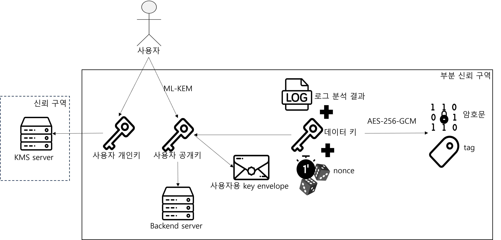
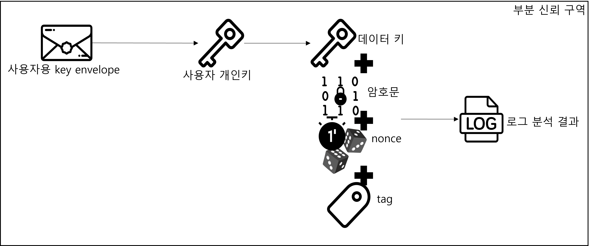
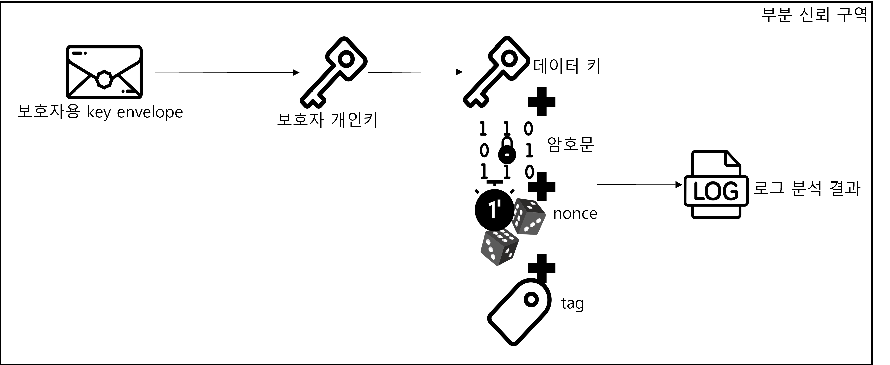

# Security Module

본 모듈은 OnCare24 프로젝트에서 로그 분석 결과를 암호화하고, Java/Python 환경에서 Rust 기반 암호화 기능을 FFI로 호출하기 위한 보안 모듈입니다.

주요 목적은 다음과 같습니다.

- 로그 분석 결과를 AES-256-GCM으로 암호화
- Data Key를 ML-KEM 기반 Key Envelope로 보호
- 사용자와 보호자 각각이 동일한 암호화 데이터를 열람할 수 있도록 Envelope 생성
- Java JNA 및 Python ctypes를 통한 FFI 연동 지원
- 백엔드 서버에서 Rust FFI DLL을 호출하는 구조 제공

---

## 1. 라이선스

본 프로젝트는 다음 외부 암호화 라이브러리를 사용합니다.

### oqs

- License: MIT OR Apache-2.0
- Repository: https://github.com/open-quantum-safe/liboqs-rust
- 설명: Rust에서 Open Quantum Safe의 양자내성암호 기능을 사용할 수 있도록 제공하는 라이브러리입니다.

### oqs-sys

- License: MIT OR Apache-2.0
- Repository: https://github.com/open-quantum-safe/liboqs-rust
- 설명: `liboqs` C 라이브러리에 대한 Rust FFI 바인딩을 제공합니다.

### liboqs

- License: MIT
- Repository: https://github.com/Open-Quantum-Safe/liboqs
- 설명: Open Quantum Safe 프로젝트에서 제공하는 양자내성암호 C 라이브러리입니다.
- Note: `liboqs` 내부에는 일부 별도 라이선스를 가진 외부 구성요소가 포함될 수 있습니다.

본 프로젝트에서 배포하는 `crypto_ffi.dll`은 위 라이브러리들을 사용하여 빌드됩니다.

### Diagram icons

README에 포함된 보안 구조도는 프로젝트 설명을 위해 직접 작성한 다이어그램입니다.

다이어그램에 사용된 일부 아이콘은 Magnific/Flaticon의 Free PNG 아이콘을 기반으로 사용했습니다.  
무료 PNG 아이콘은 출처 표기가 필요한 조건으로 사용했습니다. Premium SVG assets are not included in this repository.

- Icon source: https://www.magnific.com/
- License note: Free PNG icons require attribution. Premium SVG assets are not included in this repository.

- Server icon: [Magnific/Flaticon icon](https://www.magnific.com/icon/server_1067279#fromView=search&page=1&position=7&uuid=cbdc1f67-6a19-4e83-b7e2-00fdec49382d)
- Key icon: [Magnific/Flaticon icon](https://www.magnific.com/icon/key_18283644#fromView=search&page=1&position=7&uuid=ffe0cc53-3044-43cf-acdc-667a2a98be86)
- Envelope icon: [Magnific/Flaticon icon](https://www.magnific.com/icon/email_477572#fromView=search&page=1&position=0&uuid=226b987c-a040-4038-8f6f-4ae582836a10)
- Log icon: [Magnific/Flaticon icon](https://www.magnific.com/icon/file_15679064#fromView=search&page=1&position=10&uuid=1ac68f3c-0fd8-457b-9cb9-d9213100f205)
- Tag icon: [Magnific/Flaticon icon](https://www.magnific.com/icon/mark_11079999#fromView=search&page=1&position=5&uuid=d3bcd35d-73ea-464d-8fbf-0f77cceccb11)
- Dice icon: [Magnific/Flaticon icon](https://www.magnific.com/icon/dice_16164370#fromView=search&page=1&position=11&uuid=47d0be42-774c-4544-a375-18dd398a5918)
- Clock icon: [Magnific/Flaticon icon](https://www.magnific.com/icon/1-minute_3801033#fromView=search&page=1&position=3&uuid=902667a5-8c98-46f0-a767-990cfc1eebbc)
- Ciphertext icon: [Magnific/Flaticon icon](https://www.magnific.com/icon/binary-code_6666584)

---

## 2. 백엔드 서버 DB에 추가할 컬럼들

현재 Rust 도메인 기준으로 암호화된 로그 분석 결과는 `EncryptedLogData` 형태입니다. 일반 DB에는 암호문과 조회/검증용 메타데이터만 저장하고, Data Key 원문과 ML-KEM 개인키는 저장하지 않습니다.

### 암호화 로그 테이블 후보

| 컬럼명 | 저장 값 | 비고 |
|---|---|---|
| `encrypted_log_id` | 암호화 로그 ID | `EncryptedLogData.encrypted_log_id` |
| `user_id` | 로그 소유 사용자 ID | `EncryptedLogData.user_id` |
| `ciphertext` | AES-256-GCM으로 암호화된 분석 결과 | 평문 분석 결과는 저장하지 않음 |
| `iv` | AES-GCM IV/nonce 12바이트 | 코드 필드명은 `iv` |
| `tag` | AES-GCM 인증 tag 16바이트 | 코드 필드명은 `tag` |
| `key_id` | 암호화에 사용한 Data Key 식별자 | Data Key 값이 아니라 식별자만 저장 |
| `created_at` | 암호화 로그 생성 시각 | wire JSON에서는 `created_at_unix_seconds` |

### Key Envelope 저장 위치

Key Envelope를 일반 DB에 저장하는 구조라면 현재 `KeyEnvelope` 도메인에 맞춰 다음 값만 저장합니다.

| 컬럼명 | 저장 값 | 비고 |
|---|---|---|
| `envelope_id` | Envelope ID | `KeyEnvelope.envelope_id` |
| `key_id` | 대상 Data Key 식별자 | Data Key 값이 아님 |
| `owner_id` | Envelope를 열 수 있는 사용자/보호자 ID | `KeyEnvelope.owner_id` |
| `owner_type` | `USER` 또는 `GUARDIAN` | FFI enum 값은 `1`, `2` |
| `kem_ciphertext` | ML-KEM encapsulation 결과 | 공개 저장 가능한 envelope 구성요소 |
| `encapsulated_key` | shared secret으로 감싼 Data Key | 기존 `wrapped_data_key` 표현 대신 현재 코드명 사용 |

일반 DB에 저장하면 안 되는 값은 다음과 같습니다.

- `DataKey.key_value`: 32바이트 AES-256-GCM Data Key 원문
- ML-KEM 개인키
- 복호화된 평문 로그 분석 결과
- OpenBao/KMS secret 값

Data Key 원문은 OpenBao/KMS에 저장하고, 일반 DB에는 `key_id` 또는 KMS 경로 같은 참조값만 저장하는 방향이 안전합니다. Java OpenBao 테스트에서는 예시로 `secret/data/cap2/data-keys/{key_id}` 경로를 사용합니다.

---

## 3. 보안 구조도
사용자 키 발급 및 암호화


사용자 복호화


보호자 키 발급 및 암호화


보호자 복호화


---

## 4. 보안 구조도 설명

본 구조는 로그 분석 결과를 평문으로 저장하지 않고, AES-256-GCM으로 암호화한 뒤 사용자와 보호자가 각각 복호화할 수 있도록 Key Envelope를 생성하는 구조입니다.

전체 신뢰 구역은 다음과 같이 구분합니다.

- 모바일 앱: 비신뢰 구역
  - 클라이언트에서 전달한 사용자 ID, 역할, 보호자 관계 정보는 서버에서 다시 검증합니다.
  - Data Key, ML-KEM 개인키, 평문 로그 분석 결과는 저장하지 않습니다.

- 백엔드 서버: 부분 신뢰 구역
  - 로그 분석과 암호화를 수행합니다.
  - Rust FFI DLL을 호출하여 AES-256-GCM 암호화와 ML-KEM 기반 Key Envelope 생성을 수행합니다.

- OpenBao/KMS: 신뢰 구역
  - Data Key 원문, ML-KEM 개인키, 키 메타데이터를 관리합니다.
  - 일반 DB에는 키 원문과 개인키를 저장하지 않습니다.

백엔드 서버는 로그 분석과 암호화를 수행하지만, Data Key 원문과 ML-KEM 개인키 같은 핵심 키 정보는 OpenBao/KMS에서 관리합니다.

### 1. 키 발급 및 암호화 과정

사용자 또는 보호자가 데이터를 열람할 수 있도록 ML-KEM 기반 키 쌍을 생성합니다.

```text
ML-KEM
→ 공개키 생성
→ 개인키 생성
```

생성된 키는 다음과 같이 사용됩니다.

```text
공개키
→ Data Key를 보호하는 Key Envelope 생성에 사용

개인키
→ Key Envelope를 열어 Data Key를 복원할 때 사용
→ OpenBao/KMS에 안전하게 저장
```

로그 분석 결과가 생성되면 백엔드 서버는 현재 날짜 기준 Data Key를 사용하여 로그 분석 결과를 AES-256-GCM으로 암호화합니다.

```text
로그 분석 결과
+ Data Key
+ nonce
→ AES-256-GCM
→ 암호문
+ tag
```

각 값의 의미는 다음과 같습니다.

| 값 | 설명 |
|---|---|
| `Data Key` | 로그 분석 결과를 암호화하는 AES-256-GCM 키 |
| `nonce` | AES-GCM 암호화에 사용하는 1회성 값 |
| `ciphertext` | 암호화된 로그 분석 결과 |
| `tag` | 암호문 위변조 여부를 검증하기 위한 인증 태그 |

암호화된 로그 분석 결과는 DB에 저장할 수 있습니다.

```text
DB 저장 대상
→ ciphertext
→ nonce 또는 iv
→ tag
→ key_id
→ created_at
```

반면 Data Key 원문과 ML-KEM 개인키는 일반 DB에 저장하지 않고 OpenBao/KMS에서 관리합니다.

### 2. 사용자용 Key Envelope 생성

사용자가 로그 분석 결과를 열람할 수 있도록 사용자 공개키를 기준으로 사용자용 Key Envelope를 생성합니다.

```text
Data Key
+ 사용자 공개키
→ 사용자용 Key Envelope 생성
```

사용자용 Key Envelope에는 사용자가 나중에 Data Key를 복원할 수 있도록 필요한 정보가 들어갑니다.

```text
사용자용 Key Envelope
→ kem_ciphertext
→ encapsulated_key 또는 wrapped_data_key
→ owner_id
→ owner_type
→ key_id
```

즉, 로그 분석 결과 자체는 한 번만 암호화하고, 해당 암호문을 열 수 있는 권한은 사용자용 Envelope를 통해 부여합니다.

### 3. 보호자용 Key Envelope 생성

보호자도 같은 로그 분석 결과를 열람해야 하므로, 동일한 Data Key를 보호자 공개키 기준으로 한 번 더 보호합니다.

```text
Data Key
+ 보호자 공개키
→ 보호자용 Key Envelope 생성
```

중요한 점은 로그 분석 결과를 두 번 암호화하는 것이 아니라는 점입니다.

```text
로그 분석 결과 암호화
→ 1번만 수행

Data Key 보호
→ 사용자 공개키 기준 1개
→ 보호자 공개키 기준 1개
```

따라서 최종적으로는 하나의 암호문에 대해 사용자용 Envelope와 보호자용 Envelope가 각각 존재합니다.

```text
암호화된 로그 분석 결과
+ 사용자용 Key Envelope
+ 보호자용 Key Envelope
```

### 4. 사용자 복호화 과정

사용자가 암호화된 로그 분석 결과를 조회할 때는 사용자용 Key Envelope와 사용자 개인키를 사용합니다.

```text
사용자용 Key Envelope
+ 사용자 개인키
→ Data Key 복원
```

복원된 Data Key를 이용해 암호문을 복호화합니다.

```text
암호문
+ Data Key
+ nonce
+ tag
→ AES-256-GCM 복호화
→ 로그 분석 결과
```

이때 `tag` 검증에 실패하면 암호문이 위변조되었거나 잘못된 키를 사용한 것으로 판단하고 복호화에 실패합니다.

### 5. 보호자 복호화 과정

보호자도 같은 방식으로 복호화합니다.

다만 사용하는 Envelope와 개인키가 사용자용이 아니라 보호자용입니다.

```text
보호자용 Key Envelope
+ 보호자 개인키
→ Data Key 복원
```

그 이후 과정은 사용자와 동일합니다.

```text
암호문
+ Data Key
+ nonce
+ tag
→ AES-256-GCM 복호화
→ 로그 분석 결과
```

즉, 사용자와 보호자는 같은 암호문을 공유하지만, 각자 자신의 Envelope와 개인키를 통해 Data Key를 복원합니다.

### 6. 전체 흐름 요약

```text
1. ML-KEM으로 사용자/보호자 키 쌍 생성
2. 개인키는 OpenBao/KMS에 저장
3. 백엔드 서버가 로그 분석 결과 생성
4. 백엔드 서버가 Data Key로 로그 분석 결과를 AES-256-GCM 암호화
5. 사용자 공개키로 사용자용 Key Envelope 생성
6. 보호자 공개키로 보호자용 Key Envelope 생성
7. 암호문, nonce, tag, key_id, Envelope 메타데이터 저장
8. 조회 시 사용자/보호자 개인키로 Envelope를 열어 Data Key 복원
9. Data Key, nonce, tag를 이용해 암호문 복호화
10. 로그 분석 결과 반환
```

이 구조의 핵심은 다음과 같습니다.

```text
로그 분석 결과는 한 번만 암호화합니다.
Data Key는 사용자와 보호자 각각의 공개키 기준으로 따로 보호합니다.
개인키와 Data Key 원문은 일반 DB에 저장하지 않습니다.
복호화 권한은 Key Envelope를 통해 사용자와 보호자에게 각각 부여합니다.
```

---

## 5. FFI로 제공하는 기능

본 모듈은 `crates/crypto-ffi/include/crypto_ffi.h`의 C ABI를 Java JNA와 Python ctypes에서 호출합니다.

| 함수명 | 기능 |
|---|---|
| `crypto_ffi_facade_new_default` | Rust `CoreFacade`를 감싼 FFI handle 생성 |
| `crypto_ffi_facade_free` | FFI handle 해제 |
| `crypto_ffi_byte_buffer_free` | Rust가 반환한 `FfiByteBuffer` 메모리 해제 |
| `crypto_ffi_generate_data_key` | 32바이트 Data Key 생성 |
| `crypto_ffi_encrypt_package` | 평문, 사용자/보호자 공개키, Data Key로 암호화 패키지 JSON 생성 |
| `crypto_ffi_decrypt_package` | 암호화 패키지 JSON과 호출자 개인키로 평문 복호화 |
| `crypto_ffi_create_key_envelope` | 특정 소유자 공개키로 Data Key Envelope 생성 |
| `crypto_ffi_open_key_envelope` | Envelope와 소유자 개인키로 Data Key 복원 |
| `crypto_ffi_create_additional_recipient_envelope` | 기존 Envelope를 열 수 있는 소유자가 새 수신자 Envelope 생성 |
| `crypto_ffi_last_error_message_length` | 마지막 FFI 에러 메시지 길이 조회 |
| `crypto_ffi_last_error_message_copy` | 마지막 FFI 에러 메시지를 호출자 버퍼로 복사 |

현재 C ABI에는 ciphertext, iv, tag를 각각 받는 저수준 `encrypt`/`decrypt` 함수는 없습니다. 외부에서는 `encrypt_package`/`decrypt_package`가 주고받는 JSON 패키지를 사용합니다.

---

## 6. FFI 입출력값 설명

공통 규칙은 다음과 같습니다.

- 모든 FFI 함수는 `FfiErrorCode`를 반환합니다. 성공은 `FFI_ERROR_OK = 0`입니다.
- 실패 시 마지막 에러 메시지는 `crypto_ffi_last_error_message_length`와 `crypto_ffi_last_error_message_copy`로 읽습니다.
- 입력 바이트는 `FfiBorrowedBytes { ptr, len }`로 전달합니다. `ptr = NULL, len = 0`은 빈 바이트로 허용되지만, 필수 입력은 구현에서 빈 값 또는 null을 오류로 처리합니다.
- 출력 바이트는 `FfiByteBuffer { ptr, len, capacity }`로 반환됩니다. 호출자는 복사 후 `crypto_ffi_byte_buffer_free`를 반드시 호출해야 합니다.
- `FfiOwnerType`은 `USER = 1`, `GUARDIAN = 2`입니다.
- Python wrapper는 `bytes`, `str`, `int`, `FfiOwnerType`을 받아 내부에서 C 구조체로 변환합니다.
- Java JNA wrapper는 `byte[]`, `String`, `long`, owner type 상수를 받아 내부에서 `Memory`, `Pointer`, JNA 구조체로 변환합니다.

| 함수명 | 입력값 | 출력값 | 성공/실패 반환 방식 | 사용 목적 | Java/Python 사용자 입력 기준 |
|---|---|---|---|---|---|
| `crypto_ffi_facade_new_default` | `FfiFacadeHandle** out_handle` | 생성된 handle pointer | `FFI_ERROR_OK` 또는 에러 코드. `out_handle`이 null이면 `NULL_POINTER` | 이후 암호화 함수 호출에 사용할 facade 생성 | Python `CryptoFacade()` 생성자, Java `CryptoFfiTestSupport.create()`에서 자동 호출 |
| `crypto_ffi_facade_free` | `FfiFacadeHandle* handle` | 없음 | 성공 시 `FFI_ERROR_OK`, null/invalid handle이면 `INVALID_HANDLE` | facade 메모리 해제 | Python `close()`/context manager, Java `close()`/`finally`에서 호출 |
| `crypto_ffi_byte_buffer_free` | `FfiByteBuffer buffer` | 없음 | 성공 시 `FFI_ERROR_OK` | Rust가 반환한 출력 버퍼 해제 | Python/Java wrapper가 반환 bytes로 복사한 뒤 자동 호출 |
| `crypto_ffi_generate_data_key` | handle, `key_id`, `created_at_unix_seconds`, `expires_at_unix_seconds`, `out_buffer` | 32바이트 Data Key | 성공 시 `out_buffer`에 bytes. 실패 시 에러 코드와 last error | AES-256-GCM Data Key 생성 | Python `generate_data_key(key_id, created_at, expires_at)`, Java `generateDataKey(String keyId, long createdAt, long expiresAt)` |
| `crypto_ffi_encrypt_package` | handle, `FfiEncryptPackageRequest*`, `out_buffer` | CryptoPackage JSON bytes | 성공 시 JSON bytes. 요청/output pointer 오류, UTF-8 오류, 암호화 실패는 에러 코드 | 평문 분석 결과를 암호화하고 user/guardian envelope 포함 패키지 생성 | Python/Java: `plaintext`, `user_id`, `user_public_key`, `guardian_id`, `guardian_public_key`, `data_key_id`, 32바이트 `data_key`, 생성/만료 Unix seconds |
| `crypto_ffi_decrypt_package` | handle, `FfiDecryptPackageRequest*`, `out_buffer` | plaintext bytes | 성공 시 평문 bytes. package/private key가 비었거나 JSON이 잘못되면 에러 코드 | 패키지를 호출자 권한과 개인키로 복호화 | Python/Java: `package_bytes`, `caller_id`, `caller_type`, `private_key` |
| `crypto_ffi_create_key_envelope` | handle, `FfiCreateKeyEnvelopeRequest*`, `out_buffer` | KeyEnvelope JSON bytes | 성공 시 JSON bytes. public key 누락, owner type 오류, 암호화 실패는 에러 코드 | 특정 사용자/보호자가 Data Key를 열 수 있게 Envelope 생성 | Python/Java: `data_key_id`, 32바이트 `data_key`, 생성/만료 Unix seconds, `owner_id`, `owner_type`, `public_key` |
| `crypto_ffi_open_key_envelope` | handle, `FfiOpenKeyEnvelopeRequest*`, `out_buffer` | 32바이트 Data Key | 성공 시 Data Key bytes. envelope owner metadata가 caller와 다르면 `INVALID_ARGUMENT` | Envelope를 열어 Data Key 복원 | Python/Java: `envelope_bytes`, `caller_id`, `caller_type`, `private_key` |
| `crypto_ffi_create_additional_recipient_envelope` | handle, `FfiCreateAdditionalRecipientEnvelopeRequest*`, `out_buffer` | 새 KeyEnvelope JSON bytes | 성공 시 JSON bytes. source envelope/current key/new public key 오류는 에러 코드 | 기존 수신자가 같은 Data Key를 새 수신자에게 공유 | Python/Java: `source_envelope_bytes`, 현재 소유자 ID/type/private key, 새 소유자 ID/type/public key |
| `crypto_ffi_last_error_message_length` | 없음 | 마지막 에러 메시지 byte 길이 | `size_t` 길이 반환 | 에러 메시지 복사 전 버퍼 크기 계산 | Python/Java wrapper가 실패 코드 처리 중 자동 호출 |
| `crypto_ffi_last_error_message_copy` | `uint8_t* buffer`, `size_t buffer_len` | null-terminated UTF-8 메시지 | 성공 시 `FFI_ERROR_OK`, 버퍼가 작으면 `INVALID_LENGTH` | 마지막 에러 메시지를 호출자 메모리로 복사 | Python/Java wrapper가 length + 1 크기 버퍼를 만들고 자동 호출 |

`encrypt_package`의 출력 JSON에는 `encrypted_data`, `user_envelope`, `guardian_envelope`가 포함됩니다. `encrypted_data`는 `ciphertext`, `iv`, `tag`, `key_id`, `created_at_unix_seconds`를 포함하고, 각 envelope는 `kem_ciphertext`, `encapsulated_key`, `owner_id`, `owner_type`을 포함합니다.

---

## 7. DLL 사용 방법

Rust FFI 모듈은 Windows x64 환경에서 `crypto_ffi.dll`로 빌드됩니다.

기본 빌드 명령어는 다음과 같습니다.

```powershell
cargo build --release
```

기본 생성 위치는 다음과 같습니다.

```text
target/release/crypto_ffi.dll
```

본 프로젝트에서는 DLL 파일을 Git 저장소에 직접 커밋하지 않고, GitHub Releases를 통해 배포합니다.

Release 파일명은 실제 배포 시 확정합니다. 예시는 다음과 같습니다.

```text
crypto_ffi-windows-x64-v0.1.0.dll
```

백엔드 서버 또는 테스트 코드에서 사용할 때는 DLL 경로를 환경변수로 지정할 수 있습니다.

```powershell
$env:CRYPTO_FFI_LIBRARY="D:\path\to\crypto_ffi.dll"
```

Python ctypes wrapper의 DLL 탐색 순서는 다음과 같습니다.

1. `CryptoFacade(library_path=...)`로 직접 전달한 경로
2. `CRYPTO_FFI_LIBRARY`
3. repo `target/{debug,release}/crypto_ffi.dll`
4. 상위 workspace `target/{debug,release}/crypto_ffi.dll`

Java JNA 테스트/예제의 DLL 탐색 순서는 다음과 같습니다.

1. 실행 인자 또는 `CRYPTO_FFI_LIBRARY`
2. 테스트용 상대 경로 후보
3. repo/workspace `target/release/crypto_ffi.dll`
4. repo/workspace `target/release/deps/crypto_ffi.dll`

주의할 점은 현재 제공 대상 DLL이 Windows x64 기준이라는 점입니다.

```text
Windows 환경 -> crypto_ffi.dll
Linux/Docker 환경 -> libcrypto_ffi.so 필요
macOS 환경 -> libcrypto_ffi.dylib 필요
```

따라서 Linux 서버나 Docker 환경에서 백엔드를 실행할 경우 별도의 `.so` 빌드가 필요합니다.